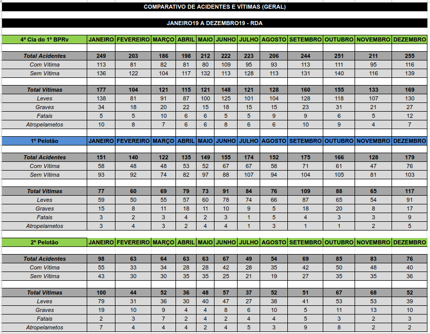
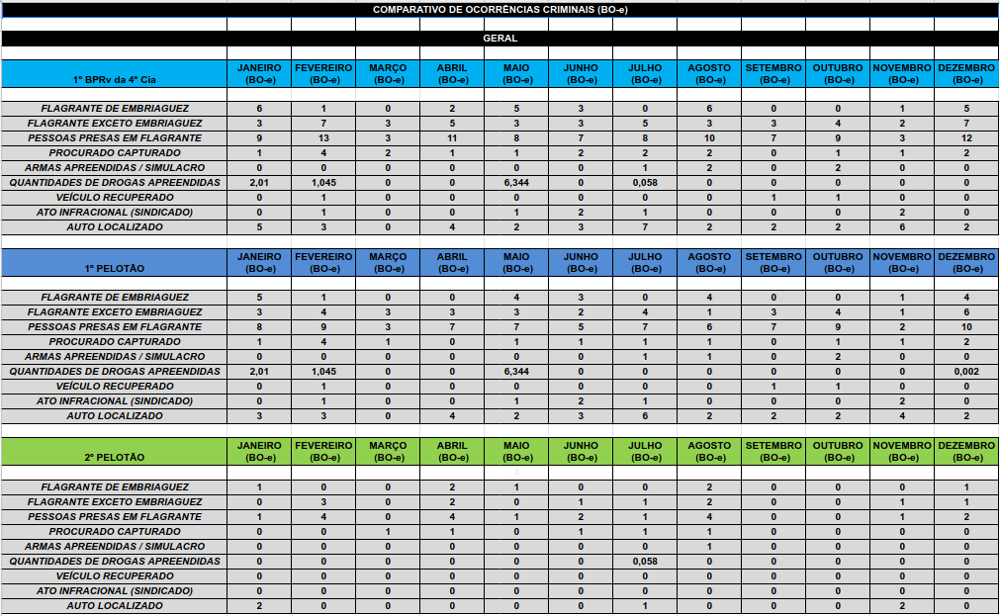
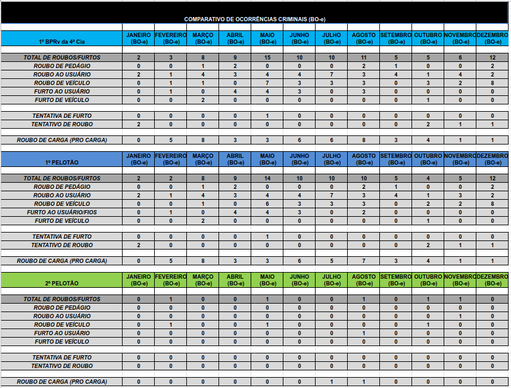

<!DOCTYPE html>
<html lang="en">
    <head>
        <meta charset="UTF-8">
        <link rel="stylesheet" href="style.css">
        <title>Comparativo Atividades Operaciosnais</title>
    </head>

    <body>
        <header>
            
Acidentes

            
Criminal Positivo

            
Criminal Negativo

        </header>
        <main>
            

            

            

        </main>
        
        <footer>anosAnteriores
            
ex2018

            
ex2017

            
ex2016

            
ex2015

            
ex2014

        </footer>

        
    </body>
</html>
